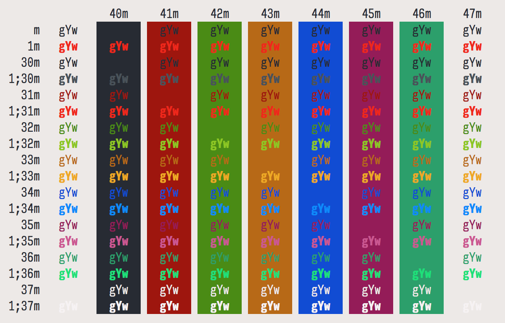
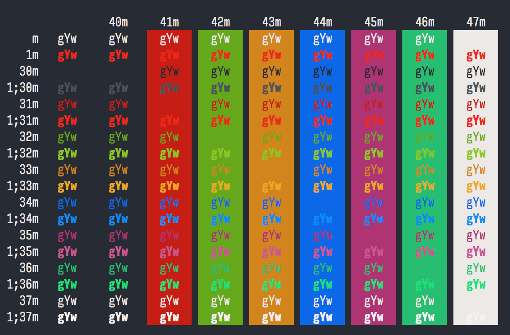
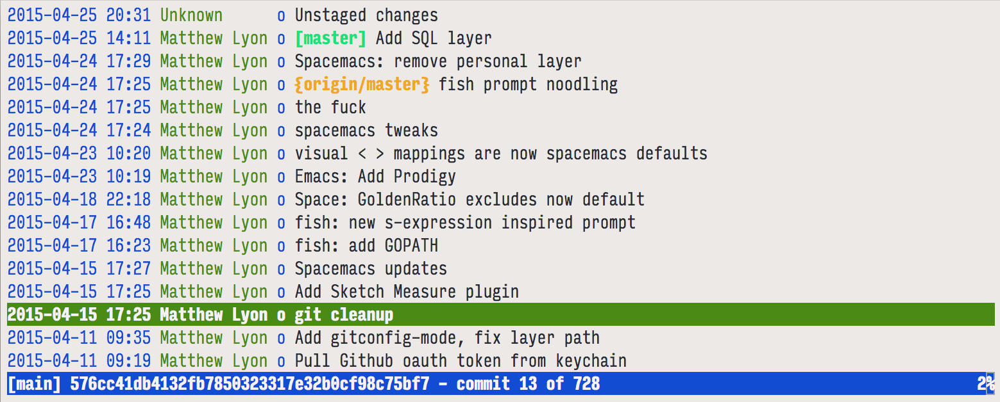
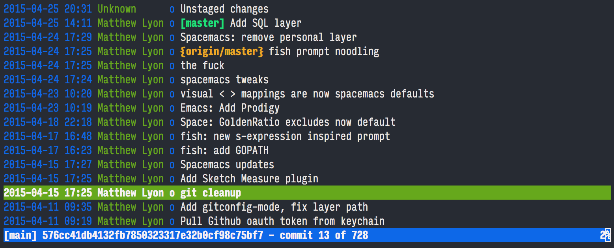

# Farmhouse Theme, iTerm2 Edition

Farmhouse is a color theme I created after having severe eye fatigue issues with a popular "Mathematically Perfect" color scheme that was too dim, and then another [color scheme of my own creation][pencil-iterm] that after a while I found too bright.

The color values are hand-picked and not perfectly balanced, yet I think quite pleasing to the eye.  The name *farmhouse* is derived from the [beer style of the same name][farmhouse-beer], one of the few styles where the fermentation process isn't strictly controlled.

[pencil-iterm]: https://github.com/mattly/iterm-colors-pencil
[farmhouse-beer]: http://www.beeradvocate.com/beer/style/129/

## Screenshots

[Colortable Test](https://github.com/mattly/dotfiles/blob/master/bin/colortable)

[Tig](http://jonas.nitro.dk/tig/)

## Related

- [Emacs theme](https://github.com/mattly/emacs-farmhouse-theme)

## License

The MIT License (MIT)

Copyright (c) 2015 Matthew Lyon

Permission is hereby granted, free of charge, to any person obtaining a copy
of this software and associated documentation files (the "Software"), to deal
in the Software without restriction, including without limitation the rights
to use, copy, modify, merge, publish, distribute, sublicense, and/or sell
copies of the Software, and to permit persons to whom the Software is
furnished to do so, subject to the following conditions:

The above copyright notice and this permission notice shall be included in all
copies or substantial portions of the Software.

THE SOFTWARE IS PROVIDED "AS IS", WITHOUT WARRANTY OF ANY KIND, EXPRESS OR
IMPLIED, INCLUDING BUT NOT LIMITED TO THE WARRANTIES OF MERCHANTABILITY,
FITNESS FOR A PARTICULAR PURPOSE AND NONINFRINGEMENT. IN NO EVENT SHALL THE
AUTHORS OR COPYRIGHT HOLDERS BE LIABLE FOR ANY CLAIM, DAMAGES OR OTHER
LIABILITY, WHETHER IN AN ACTION OF CONTRACT, TORT OR OTHERWISE, ARISING FROM,
OUT OF OR IN CONNECTION WITH THE SOFTWARE OR THE USE OR OTHER DEALINGS IN THE
SOFTWARE.
